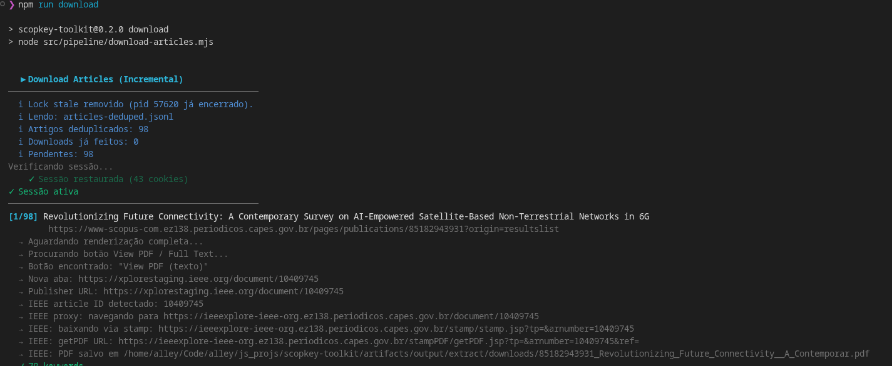

# ScopKey Toolkit .𖥔 ݁ ˖ִ🛸༄˖°.

Este projeto foi criado para viabilizar a coleta de uma lista grande de keywords no Scopus quando a API não está disponível no acesso atual via CAPES/CAFe.
Como o acesso normal do site não permitia obter essas keywords de forma direta, o toolkit automatiza busca, extração de `Author Keywords` e organização local dos resultados.

Espero que este projeto te seja útil!, passei uns dias e madrugadas me dedicando a ele. (ᴗ˳ᴗ)ᶻz

- fluxo completo de coleta, extração, limpeza, ranking e ordenação local
- extração de múltiplos grupos de keywords (Author Keywords, Indexed Keywords, Engineering terms)
- extração de abstract integrada ao mesmo passo do `extract`
- deduplicação de artigos com saída em JSONL, JSON e CSV
- categorização por grupos de pesquisa configuráveis
- **download automático de PDFs via IEEE Xplore com autenticação CAPES/CAFe** _(v2.1)_
- **queries via `TITLE-ABS-KEY` com busca avançada** _(v0.4)_
- **`query` opcional — buscas definidas inteiramente via `categoryIds`** _(v0.4)_
- **ordenação padrão por citações (`citedBy`)** _(v0.4)_
- persistência de sessão em `artifacts/session/auth-cookies.json`
- saídas versionadas por timestamp em `artifacts/output/`
- arquivos de busca vazios não são salvos (0 artigos coletados)

## Fluxo

```
searches.json → collect → extract → abstracts → dedupe → categorize
                                  ↘ clean / rank / sortby
                                                          ↘ download
```

## Configuração

### 1. Ambiente

Copie `.env.EXAMPLE` para `.env` e preencha:

```env
CAFE_ACCESS_URL=       # URL de acesso CAFe da sua instituição
SCOPUS_HOME_URL=       # URL home do Scopus (via proxy)
SCOPUS_RESULTS_URL=    # URL de resultados do Scopus (via proxy)

CAFE_USERNAME=         # Usuário institucional
CAFE_PASSWORD=         # Senha (suporta PASS:caminho/no/pass para pass(1))

CAFE_INSTITUTION_ID=   # ID/nome da instituição no formulário CAFe
CAFE_LOGIN_AUTOFILL_MODE=both   # username | password | both
CAFE_AUTO_CLICK_LOGIN=false     # true = clica no botão automaticamente

SLOW_MO=50
DELAY_MS=1500
CAFE_STEP_DELAY_MS=1200
CHROMIUM_EXECUTABLE_PATH=      # opcional: caminho do Chromium

IEEE_BASE_URL=                 # URL base do IEEE Xplore via proxy CAPES (ex: https://ieeexplore-ieee-org.ez138.periodicos.capes.gov.br/document/)
```

### 2. Buscas (`config/searches.json`)

Define as buscas a serem realizadas. Apenas `id` e pelo menos um entre `query` ou `categoryIds` são obrigatórios — todos os outros campos são opcionais.

```json
[
  {
    "id": "minha-busca",
    "categoryIds": ["cat_a", "cat_b"],
    "yearFrom": 2020,
    "yearTo": 2026,
    "docTypes": ["ar", "re"],
    "sortBy": "citedBy"
  },
  {
    "id": "busca-com-query",
    "query": "(\"meu termo\" OR \"termo alternativo\")",
    "categoryIds": ["cat_a"],
    "sourceTitle": "IEEE Transactions on Communications",
    "yearFrom": 2020,
    "yearTo": 2026,
    "docTypes": ["ar"],
    "sortBy": "citedBy"
  }
]
```

- **`query` é opcional** — se omitido, a query vem inteiramente dos `categoryIds`
- **`categoryIds`** combina múltiplas categorias com `AND` entre elas
- A query final é sempre encapsulada em `TITLE-ABS-KEY(...)` (busca avançada)
- Buscas que retornam 0 artigos não geram arquivo de saída

> `maxResults` foi removido — a coleta agora pagina todos os resultados encontrados pelo Scopus sem limite.

## Comandos

### Setup e login

```bash
npm run setup    # instala dependências, cria .env e instala o Chromium
npm run login    # autentica via CAFe e salva sessão em artifacts/session/auth-cookies.json
```

### Pipeline

```bash
npm run collect                         # coleta links (resume automático, sem limite)
npm run extract                         # extrai keywords + abstract (incremental, 2 abas)
npm run extract -- --concurrency 3      # extração paralela com 3 abas
npm run collect-extract                 # collect + extract em paralelo
npm run abstracts                       # extrai abstracts separadamente (sessões anteriores)
npm run dedupe                          # consolida todos os extracts → JSONL + JSON + CSV
npm run categorize                      # categoriza artigos por grupos de pesquisa
npm run download                        # baixa PDFs dos artigos deduplicados (requer IEEE_ARTICLE_URL no .env)
npm run clean                           # deduplicação + tradução automática de keywords
npm run rank                            # ranking de keywords por citações
```

### O que cada comando gera

- `npm run collect` → `artifacts/output/collect/<ts>/links-<id>-<ts>.json` por configuração de busca
- `npm run extract` → por sessão em `artifacts/output/extract/<ts>/`:
  - `results/results-<ts>.jsonl` — keywords + abstract + groups por artigo
  - `failures/failures-<ts>.jsonl` — erros técnicos de tentativa
  - `no-keywords/no-keywords-<ts>.jsonl` — artigos sem keywords após retries
- `npm run abstracts` → `artifacts/output/extract/<ts>/abstracts/abstracts-<ts>.jsonl`
- `npm run dedupe` → `artifacts/output/extract/deduped/`:
  - `articles-deduped.jsonl` — um artigo por linha
  - `articles-deduped.json` — array JSON completo (fácil de abrir/baixar)
  - `articles-deduped.csv` — planilha com todas as colunas
- `npm run categorize` → `artifacts/output/extract/deduped/articles-categorized.jsonl`
- `npm run download` → `artifacts/output/extract/downloads/`:
  - `<id>_<titulo>.pdf` — PDF de cada artigo
  - `logs/downloads-<ts>.jsonl` — log de cada sessão (sucesso/falha por artigo)
- `npm run clean` → `artifacts/output/extract/clean/clean-<ts>.jsonl`
- `npm run rank` → `artifacts/output/extract/ranked/`

### Ordenação local

Não realiza requisições. Lê o último `links-*.json` e reordena.

```bash
npm run sortby -- --preset cited-highest   # mais citados primeiro
npm run sortby -- --preset cited-lowest
npm run sortby -- --preset date-newest     # mais recentes primeiro
npm run sortby -- --preset date-oldest
npm run sortby -- --preset relevance       # ordem original do Scopus

npm run sortby -- --sortBy citedBy --sortDirection highest
npm run sortby -- --sortBy date --sortDirection oldest
```

Saída da ordenação:
- `artifacts/output/sorted/<preset>/<busca>-<ts>.jsonl`

## Testes e Coverage

```bash
npm test               # executa a suíte de testes
npm run test:coverage  # gera relatório de cobertura no terminal
```

## Saída

```text
artifacts/
├── browser/
│   └── user-data/                           # perfil persistente do Playwright
├── session/
│   └── auth-cookies.json                    # sessão persistida pelo login
└── output/
    ├── collect/
    │   └── <ts>/
    │       └── links-<id>-<ts>.json         # artigos por busca (sem limite de paginação)
    ├── extract/
    │   ├── <ts>/                            # sessão de extração
    │   │   ├── results/results-<ts>.jsonl   # keywords + abstract + groups
    │   │   ├── abstracts/abstracts-<ts>.jsonl
    │   │   ├── failures/failures-<ts>.jsonl
    │   │   └── no-keywords/no-keywords-<ts>.jsonl
    │   ├── deduped/
    │   │   ├── articles-deduped.jsonl       # todos os artigos, sem duplicatas
    │   │   ├── articles-deduped.json        # idem em JSON
    │   │   └── articles-deduped.csv         # idem em CSV
    │   ├── downloads/
    │   │   ├── <id>_<titulo>.pdf            # PDFs baixados
    │   │   └── logs/downloads-<ts>.jsonl    # log de cada sessão de download
    │   ├── clean/clean-<ts>.jsonl           # keywords normalizadas/traduzidas
    │   └── ranked/
    │       ├── ranked-keywords-<ts>.jsonl
    │       └── ranked-articles-<ts>.jsonl
    └── sorted/
        └── <preset>/
            └── <busca>-<ts>.jsonl           # artigos reordenados
```

## Screenshots

**Login (`npm run login`)**
Exemplo mostrando a autenticação via CAFe e a persistência da sessão em `artifacts/session/auth-cookies.json`.


**Collect (`npm run collect`)**
Exemplo mostrando a coleta dos links/artigos a partir das buscas configuradas no `config/searches.json`.


Neste arquivo, você pode adicionar mais opções de busca, atualmente existe um exemplo para "nanosatelites".

O fluxo de `extract` não aparece nesses dois prints.

**Download (`npm run download`)**
Exemplo mostrando o download incremental de PDFs via IEEE Xplore autenticado pelo proxy CAPES. O script retoma de onde parou, pulando artigos já baixados com sucesso.


O fluxo navega automaticamente pelo Scopus → IEEE Xplore → `stamp.jsp` → `getPDF.jsp`, reutilizando a sessão do browser para contornar o bloqueio de bot do proxy CloudFront.

**Extract (`npm run extract`)**
Exemplo mostrando a extração dos keywords a partir das buscas configuradas no `config/searches.json`.
  

Interpretação rápida do resultado do `extract`:
- `results`: keywords encontradas com sucesso.
- `failures`: erro técnico na extração daquela tentativa (não significa necessariamente ausência de keywords).
- `no-keywords`: após retries, o artigo foi classificado sem keywords relevantes no registro (na prática, sem `Author Keywords` e sem `Indexed Keywords` utilizáveis para o pipeline).

## Troubleshooting

- `failures` no `extract`: indica falha técnica da tentativa (timeout, bloqueio de página, sessão expirada, navegação interrompida).
- `failures` no `extract`: não significa automaticamente que o artigo não tem keywords.
- `no-keywords` no `extract`: indica que, após retries, não foi possível obter keywords utilizáveis no artigo.
- `no-keywords` no `extract`: na prática do pipeline, isso normalmente significa ausência/indisponibilidade de `Author Keywords` e também de `Indexed Keywords` aproveitáveis.
- erro de sessão/autenticação: rode `npm run login` novamente para renovar `artifacts/session/auth-cookies.json`.
- `sortby` sem arquivo de coleta: rode `npm run collect` antes para gerar `artifacts/output/collect/links-*.json`.

## Validação local

Comandos validados localmente neste projeto:
- `npm test`
- `npm run sortby -- --preset relevance`
- `npm run clean`
- `npm run rank`

Observação:
- `collect` e `collect-extract` dependem de acesso externo ao Scopus/CAFe, então o comportamento final pode variar conforme sessão, credenciais e disponibilidade da página.

## Hooks (Husky)

Este projeto usa hooks em `.husky/` (não usa `.githooks`).

- `pre-commit` (`.husky/pre-commit`): roda `node scripts/pre-commit.mjs`
- `pre-push` (`.husky/pre-push`): roda `node scripts/pre-push.mjs`
- `scripts/pre-commit.mjs`: valida sintaxe dos `.mjs` staged e executa `npm test`
- `scripts/pre-push.mjs`: executa `npm test` e `npm run test:coverage`

Para testar localmente:

```bash
./.husky/pre-commit
./.husky/pre-push
```

## Contribuindo

### Fork e PR

```bash
# 1. Fork no GitHub → clone do seu fork
git clone https://github.com/<seu-usuario>/scopkey-toolkit.git
cd scopkey-toolkit

# 2. Instalar dependências
npm install

# 3. Criar branch
git checkout -b feat/minha-mudanca

# 4. Fazer as alterações e garantir que tudo passa
npm test

# 5. Commit e push
git add .
git commit -m "feat: descrição da mudança"
git push origin feat/minha-mudanca

# 6. Abrir PR no GitHub
```

O CI roda `npm test` automaticamente em todo PR. O template de PR em `.github/PULL_REQUEST_TEMPLATE.md` guia o que preencher.

### Criar um release (mantenedores)

```bash
npm run release           # patch: 0.x.y → 0.x.(y+1)
npm run release -- minor  # minor: 0.x.y → 0.(x+1).0
npm run release -- major  # major: 0.x.y → 1.0.0
```

O script valida testes, bumpa a versão, faz commit + tag e push. Para gerar o pacote comprimido: `npm pack`.

## Licença

Este projeto está licenciado conforme [LICENSE.md](LICENSE.md).  
Contribua para ampliar o acesso livre ao conhecimento! ✌️👽

---

<sub>_Em caso de dúvidas, me contate no Telegram, @heyalley_ (⚈₋₍⚈).</sub>
