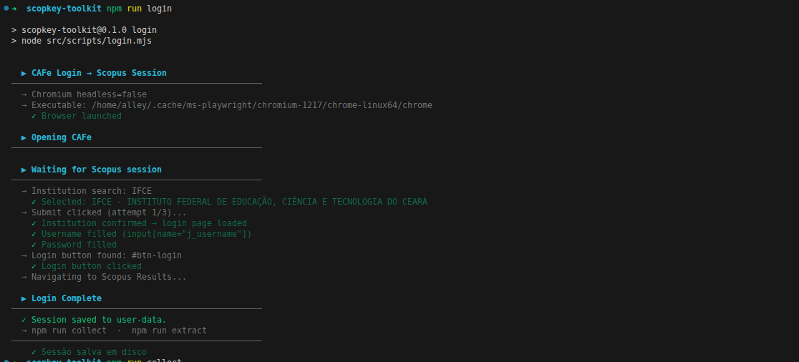
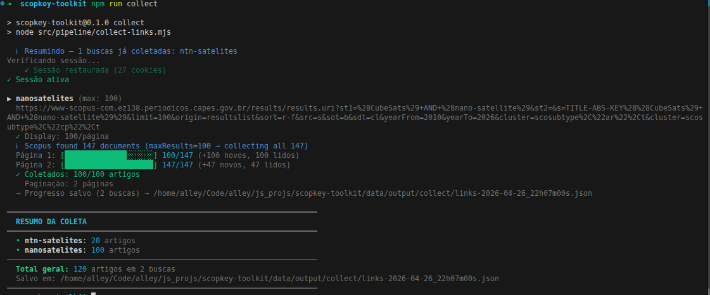

# ScopKey Toolkit .𖥔 ݁ ˖ִ🛸༄˖°.

Este projeto foi criado para viabilizar a coleta de uma lista grande de keywords no Scopus quando a API não está disponível no acesso atual via CAPES/CAFe.
Como o acesso normal do site não permitia obter essas keywords de forma direta, o toolkit automatiza busca, extração de `Author Keywords` e organização local dos resultados.

Espero que este projeto te seja útil!, passei uns dias e madrugadas me dedicando a ele. (ᴗ˳ᴗ)ᶻz

- fluxo completo de coleta, extração, limpeza, ranking e ordenação local
- persistência de sessão em `artifacts/session/auth-cookies.json`
- saídas versionadas por timestamp em `artifacts/output/`

## Fluxo

```
searches.json → collect → extract → clean / rank / sortby
```

## Configuração

### 1. Ambiente

Copie `.env.EXAMPLE` para `.env` e preencha:

```env
CAFE_ACCESS_URL=       # URL de acesso CAFe da sua instituição
SCOPUS_HOME_URL=       # URL home do Scopus (via proxy)
SCOPUS_RESULTS_URL=    # URL de resultados do Scopus (via proxy)

CAFE_USERNAME=         # Usuário institucional
CAFE_PASSWORD=         # Senha (suporta PASS:caminho/no/pass para pass(1))

CAFE_INSTITUTION_ID=   # ID/nome da instituição no formulário CAFe
CAFE_LOGIN_AUTOFILL_MODE=both   # username | password | both
CAFE_AUTO_CLICK_LOGIN=false     # true = clica no botão automaticamente

SLOW_MO=50
DELAY_MS=1500
CAFE_STEP_DELAY_MS=1200
CHROMIUM_EXECUTABLE_PATH=      # opcional: caminho do Chromium
```

### 2. Buscas (`config/searches.json`)

```json
[{
  "name": "id-busca",
  "query": "termos AND busca",
  "yearFrom": 2020,
  "yearTo": 2026,
  "docTypes": ["ar", "cp"],
  "sortBy": "date|citedBy|relevance",
  "sortDirection": "newest|oldest|highest|lowest",
  "maxResults": 200
}]
```

## Comandos

### Setup e login

```bash
npm run setup    # instala dependências, cria .env e instala o Chromium
npm run login    # autentica via CAFe e salva sessão em artifacts/session/auth-cookies.json
```

### Pipeline

```bash
npm run collect                         # coleta links (resume automático)
npm run extract                         # extrai keywords (incremental, 2 abas)
npm run extract -- --concurrency 3      # extração paralela com 3 abas
npm run collect-extract                 # collect + extract em paralelo
npm run clean                           # deduplicação + tradução automática
npm run rank                            # ranking de keywords por citações
```

### O que cada comando gera

- `npm run collect`: cria `artifacts/output/collect/links-<ts>.json` com os artigos encontrados por busca.
- `npm run extract`: tenta extrair keywords de cada artigo.
- `artifacts/output/extract/results/`: registros com keywords encontradas.
- `artifacts/output/extract/failures/`: erros de processamento da tentativa (ex.: timeout, bloqueio, erro de página).
- `artifacts/output/extract/no-keywords/`: registros sem keywords após as tentativas de retry.
- `npm run collect-extract`: executa coleta e extração em sequência.
- `npm run clean`: normaliza/deduplica keywords e salva em `artifacts/output/extract/clean/`.
- `npm run rank`: gera ranking de keywords e de artigos em `artifacts/output/extract/ranked/`.

### Ordenação local

Não realiza requisições. Lê o último `links-*.json` e reordena.

```bash
npm run sortby -- --preset cited-highest   # mais citados primeiro
npm run sortby -- --preset cited-lowest
npm run sortby -- --preset date-newest     # mais recentes primeiro
npm run sortby -- --preset date-oldest
npm run sortby -- --preset relevance       # ordem original do Scopus

npm run sortby -- --sortBy citedBy --sortDirection highest
npm run sortby -- --sortBy date --sortDirection oldest
```

Saída da ordenação:
- `artifacts/output/sorted/<preset>/<busca>-<ts>.jsonl`

## Testes e Coverage

```bash
npm test               # executa a suíte de testes
npm run test:coverage  # gera relatório de cobertura no terminal
```

## Saída

```text
artifacts/
├── browser/
│   └── user-data/                           # perfil persistente do Playwright
├── session/
│   └── auth-cookies.json                    # sessão persistida pelo login
└── output/
    ├── collect/
    │   └── links-<ts>.json                  # artigos coletados
    ├── extract/
    │   ├── results/results-<ts>.jsonl       # artigos com keywords
    │   ├── failures/failures-<ts>.jsonl     # erros e retries
    │   ├── no-keywords/no-keywords-<ts>.jsonl
    │   ├── clean/clean-<ts>.jsonl           # keywords limpas
    │   └── ranked/
    │       ├── ranked-keywords-<ts>.jsonl   # keywords por citações
    │       └── ranked-articles-<ts>.jsonl   # artigos por citações
    └── sorted/
        └── <preset>/
            └── <busca>-<ts>.jsonl           # artigos reordenados
```

## Screenshots

**Login (`npm run login`)**
Exemplo mostrando a autenticação via CAFe e a persistência da sessão em `artifacts/session/auth-cookies.json`.


**Collect (`npm run collect`)**
Exemplo mostrando a coleta dos links/artigos a partir das buscas configuradas no `config/searches.json`.


Neste arquivo, você pode adicionar mais opções de busca, atualmente existe um exemplo para "nanosatelites".

O fluxo de `extract` não aparece nesses dois prints.

**Extract (`npm run extract`)**
Exemplo mostrando a extração dos keywords a partir das buscas configuradas no `config/searches.json`.
  

Interpretação rápida do resultado do `extract`:
- `results`: keywords encontradas com sucesso.
- `failures`: erro técnico na extração daquela tentativa (não significa necessariamente ausência de keywords).
- `no-keywords`: após retries, o artigo foi classificado sem keywords relevantes no registro (na prática, sem `Author Keywords` e sem `Indexed Keywords` utilizáveis para o pipeline).

## Troubleshooting

- `failures` no `extract`: indica falha técnica da tentativa (timeout, bloqueio de página, sessão expirada, navegação interrompida).
- `failures` no `extract`: não significa automaticamente que o artigo não tem keywords.
- `no-keywords` no `extract`: indica que, após retries, não foi possível obter keywords utilizáveis no artigo.
- `no-keywords` no `extract`: na prática do pipeline, isso normalmente significa ausência/indisponibilidade de `Author Keywords` e também de `Indexed Keywords` aproveitáveis.
- erro de sessão/autenticação: rode `npm run login` novamente para renovar `artifacts/session/auth-cookies.json`.
- `sortby` sem arquivo de coleta: rode `npm run collect` antes para gerar `artifacts/output/collect/links-*.json`.

## Validação local

Comandos validados localmente neste projeto:
- `npm test`
- `npm run sortby -- --preset relevance`
- `npm run clean`
- `npm run rank`

Observação:
- `collect` e `collect-extract` dependem de acesso externo ao Scopus/CAFe, então o comportamento final pode variar conforme sessão, credenciais e disponibilidade da página.

## Hooks (Husky)

Este projeto usa hooks em `.husky/` (não usa `.githooks`).

- `pre-commit` (`.husky/pre-commit`): roda `node scripts/pre-commit.mjs`
- `pre-push` (`.husky/pre-push`): roda `node scripts/pre-push.mjs`
- `scripts/pre-commit.mjs`: valida sintaxe dos `.mjs` staged e executa `npm test`
- `scripts/pre-push.mjs`: executa `npm test` e `npm run test:coverage`

Para testar localmente:

```bash
./.husky/pre-commit
./.husky/pre-push
```

## Licença

Este projeto está licenciado conforme [LICENSE.md](LICENSE.md).  
Contribua para ampliar o acesso livre ao conhecimento! ✌️👽

<sub>_Em caso de dúvidas, me contate no Telegram, @heyalley_ (⚈₋₍⚈).</sub>
